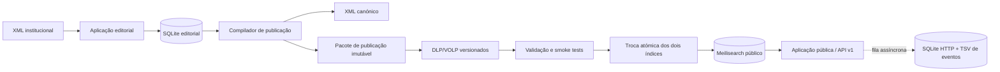

# Arquitetura implementada

Esta implementação segue o ponto 4 do documento de referência.

## Fronteiras

- O SQLite é armazenamento de trabalho editorial, não o motor da aplicação
  pública.
- O XML é preservado e exportável.
- O contrato JSON público é independente do XML, SQLite e Meilisearch.
- O pacote de publicação é versionado, verificável e reconstruível.
- O Meilisearch só é consultado através de `SearchService` e
  `EntryRepository`.
- `ReleaseService` expõe a identidade e compatibilidade da versão ativa.
- Os índices versionados são construídos e testados antes de qualquer troca
  pública. DLP e VOLP são trocados numa operação atómica e as versões
  anteriores ficam disponíveis para reversão.
- A interface pública conserva o visual validado na PoC anterior, mas as
  pesquisas, facetas, catálogo e detalhes são fornecidos pela nova API.
- O log de utilização é separado da base editorial e escrito em segundo
  plano, para não acrescentar latência ao pedido público. O SQLite semanal
  conserva os pedidos HTTP; o TSV semanal conserva a sequência causal de
  ações e respostas da UI através de `session` e `seq`.

## Estado desta iteração

Implementado:

- esquema SQLite editorial;
- importação XML incremental;
- preservação de XML e SHA-256;
- projeção pública neutra;
- contratos JSON v1;
- NDJSON separado por recurso;
- XML canónico;
- manifesto, checksums e relatório de validação;
- configuração Meilisearch;
- indexação por release e troca atómica;
- interfaces internas de pesquisa, entradas e releases;
- API pública v1 e camada de compatibilidade para a interface validada;
- catálogo integral, scroll infinito e navegação alfabética;
- interface pública completa, estatísticas, dados e diagnóstico XML/JSON;
- aplicação editorial com edição estruturada e preservação do XML;
- concorrência otimista, revisões, validação e workflow;
- compilação/publicação assíncrona a partir do editor;
- registo local de IP, pesquisa, rota, agente, estado HTTP e duração;
- expansões das classes, domínios e estados;
- fontes externas preservadas com ativação de publicação reversível; a SPE
  encontra-se adiada e não é projetada na release atual;
- hiperligações lexicais exatas pré-calculadas durante a publicação;
- ativação e reversão local;
- testes de importação, fidelidade, edição, workflow, pacote, ativação,
  reversão e falha segura antes da troca pública;
- Relax NG oficial, regras editoriais essenciais e relatórios persistentes;
- listas controladas governadas e auditadas;
- catálogo de oito casos de aceitação executável.

## Primeira release integral validada

Release local ativa: `local-2026-008`.

- 244 124 entradas;
- 105 955 entradas de Dicionário;
- 138 169 entradas de Vocabulário;
- 232 317 aceções públicas;
- 232 088 definições;
- 324 326 formas;
- 131 466 relações;
- 72 070 etiquetas;
- 255 enriquecimentos SPE preservados mas não publicados;
- 3 485 termos SPE preservados para reconciliação futura;
- 1 242 imagens incluídas;
- zero erros de importação ou projeção pública;
- todos os ficheiros inventariados com tamanho e SHA-256 no manifesto; a
  aprovação exige verificação integral.

Fora do âmbito da Fase 1:

- autenticação e perfis de utilizador antes de uma implantação institucional;
- interface de reconciliação dos 3 485 termos SPE ainda sem associação;
- decisão editorial sobre a divergência entre o corpus legado e o Relax NG;
- aprovação institucional das listas controladas e dos casos de aceitação.

## Desempenho local medido

Depois de aquecido, no corpus integral:

- contagens: aproximadamente 2 ms;
- pesquisa por “exatidão”: aproximadamente 18 ms;
- primeira página do catálogo (60 entradas): aproximadamente 24 ms;
- 173 domínios e 75 classes nas facetas globais: aproximadamente 55 ms;
- pesquisa editorial por prefixo: aproximadamente 1 ms.

As listas pedem ao Meilisearch apenas atributos de resumo; XML, JSON
estruturado completo e imagens só são obtidos quando se abre uma entrada.
